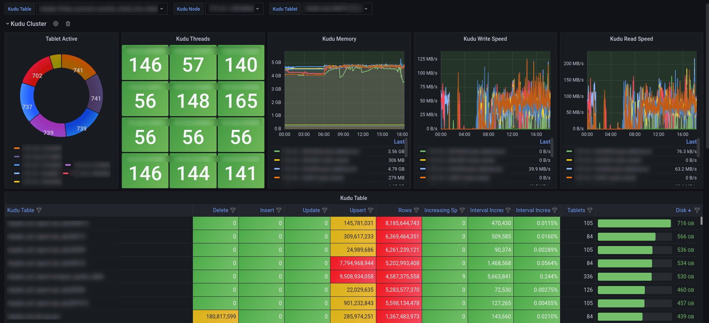

# Prometheus-Kudu-Exporter

  

Kudu Exporter, fetching metrics by multi-thread from [Kudu Rest API](https://kudu.apache.org/docs/administration.html#_collecting_metrics_via_http) and reporting them by standalone or push-gateway, can be applied high-availably for Prometheus and Grafana.

1. [Installation](#Installation)
   1. [Compile](#Compile)
   2. [Configuration](#Configuration)
   3. [Run Server](#Run-Server)
2. [Reference](#Reference)
   1. [Reporting Methods](#Reporting-Methods)
   2. [Metrics Filter](#Metrics-Filter)
3. [Contributing](#Contributing)
4. [License](#License)



*Node: **grafana-kudu-dashboard** can be [download](https://github.com/MagicDevilZhang/prometheus-kudu-exporter/releases/download/v0.2.0/grafana-kudu-dashboard.json) as an example.*


# Installation

The project can be deployed in many ways, and we suggest as following.

## Compile

Kudu Exporter, finished by Java, need to compile before deploying. Download this project and compile it after **maven** and **git** is installed.

```shell
# Install Git and Maven
$ sudo apt-get update
$ sudo apt install git maven

# Clone this project
$ sudo git clone https://github.com/magicdevilzhang/prometheus-kudu-exporter.git
$ sudo cd ./prometheus-kudu-exporter

# Compile by Maven
$ sudo mvn clean package
```

Alternatively, we also prepared compiled binary archive for use, please download from [Releases Page](https://github.com/MagicDevilZhang/prometheus-kudu-exporter/releases).

```shell
# Download this project
$ sudo wget https://github.com/MagicDevilZhang/prometheus-kudu-exporter/releases/download/.../xxx.tar.gz
$ tar -zxvf xxx.tar.gz
$ sudo cd ./prometheus-kudu-exporter
```

## Configuration

Kudu Exporter support **Standalone** or **Push-Gateway** deployment. Standalone deployment can provide HTTP server that fetching metric resources into metric pool in advance to wait Prometheus getting metrics periodically. Alternatively, the Push-Gateway deployment, as we suggest, can reporting standard metrics to Prometheus Push Gateway infinitively and periodically. 

Here is some examples to configure report method in Kudu Exporter by create or edit `./conf/kudu-exporter.yml`.

- Standalone Deployment (Local Reporter)

```yaml
# Fetcher Configuration
# Port of Kudu Server should be 8051, and Kudu Tablet Server should be 8050
prom.kudu.fetcher.classname: io.prometheus.kudu.fetcher.KuduMetricRestFetcher
prom.kudu.fetcher.kudu-nodes: [ 127.0.0.1:8051, 127.0.0.1:8050 ]
prom.kudu.fetcher.interval: 10000

# Standalone Reporter Configuration
# Please visit http://localhost:9055/metrics to check kudu-exporter status after start
prom.kudu.reporter.classname: io.prometheus.kudu.reporter.KuduMetricLocalReporter
prom.kudu.reporter.local.port: 9055

# Push-Gateway Reporter Configuration
# Push-Gateway should be install before running kudu-exporter
#prom.kudu.reporter.classname: io.prometheus.kudu.reporter.KuduMetricPushGatewayReporter
#prom.kudu.reporter.pushgateway.host: 127.0.0.1:9091
#prom.kudu.reporter.pushgateway.interval: 10000
```

- Push-Gateway Deployment ***(Recommend)***

```yaml
# Fetcher Configuration
# Port of Kudu Server should be 8051, and Kudu Tablet Server should be 8050
prom.kudu.fetcher.classname: io.prometheus.kudu.fetcher.KuduMetricRestFetcher
prom.kudu.fetcher.kudu-nodes: [ 127.0.0.1:8051, 127.0.0.1:8050 ]
prom.kudu.fetcher.interval: 10000

# Standalone Reporter Configuration
# Please visit http://localhost:9055/metrics to check kudu-exporter status after start
#prom.kudu.reporter.classname: io.prometheus.kudu.reporter.KuduMetricLocalReporter
#prom.kudu.reporter.local.port: 9055

# Push-Gateway Reporter Configuration
# Push-Gateway should be install before running kudu-exporter
prom.kudu.reporter.classname: io.prometheus.kudu.reporter.KuduMetricPushGatewayReporter
prom.kudu.reporter.pushgateway.host: 127.0.0.1:9091
prom.kudu.reporter.pushgateway.interval: 10000
```

## Run Server

Kudu Exporter can be run as multi-thread with less system resource after compiling and configuring correctly. 

```shell
$ nohup bash ./bin/kudu-exporter.sh &
```

Once start successfully, please visit: 

- Standalone Reporter (Local Reporter): http://localhost:9055/metrics.
- Push-Gateway Reporter: http://pushgateway-ip:port/metrics/.

Alternatively, if you need to run Kudu Exporter jar manually, following this method.

```shell
$ java -jar ./lib/prometheus-kudu-exporter-x.x.x.jar \
       --config ./conf/kudu-exporter.yml \
       --include ./conf/include-metrics \
       --exclude ./conf/exclude-metrics
```

# Reference

The directory `conf` is the configuration of Kudu Exporter. We try our best to balance the simplified configuration, as Prometheus official suggested, and custom features. Although Kudu Exporter can be effectively deployed as above-mentioned steps, you can also follow next guideline if you have specially requirements.

*Note: More function requirements can be met by email us or create issue in GitHub.*

## Reporting Methods

**Standalone** or **Push-Gateway** deployment are provided respectively, which you can configure them as above-mentioned [Configuration](#Configuration). Push-Gateway is what we suggested if each server node has different Prometheus exporter such as node exporter, Flink exporter, MySQL exporter, etc. You need to let different Prometheus exporters report their metrics into one collector(like [Push-Gateway](https://github.com/prometheus/pushgateway))  to reduce the listening port using.

Further more, the meaning of `./conf/kudu-exporter.yml` is as following list.

|                parameter                |     type     |                       default                       |                            detail                            |
| :-------------------------------------: | :----------: | :-------------------------------------------------: | :----------------------------------------------------------: |
|       prom.kudu.fetcher.classname       |    string    |  io.prometheus.kudu.fetcher.KuduMetricRestFetcher   | Fetcher aim at getting metrics from Kudu. No more fetchers supported currently. |
|      prom.kudu.fetcher.kudu-nodes       | list(string) |                        null                         |         Try visit http://ip:port/metrics to verify.          |
|       prom.kudu.fetcher.interval        |     long     |                     10000 (ms)                      |         Fetcher take this as a cycle to get metrics.         |
|      prom.kudu.reporter.classname       |    string    | io.prometheus.kudu.reporter.KuduMetricLocalReporter |         [Standalone / Push-Gateway](#Configuration)          |
|      prom.kudu.reporter.local.port      |   integer    |                        9055                         | Only KuduMetricLocalReporter support it to get metrics via http://127.0.0.1:9055/ |
|   prom.kudu.reporter.pushgateway.host   |    string    |                        null                         |                  Push-Gateway host and port                  |
| prom.kudu.reporter.pushgateway.interval |     long     |                     10000 (ms)                      |        Reporter take this as a cycle to put metrics.         |

## Metrics Filter

Kudu Exporter supports an ocean of metrics, you can filter them via keywords by editing `./conf/include-metrics` or `./conf/exclude-metrics`. Please follow [Kudu Metrics Reference](https://kudu.apache.org/docs/metrics_reference.html) to find what metrics you need.

Here is our recommendation and examples:

- on_disk_data_size: Space used by this tablet’s data blocks.
- live_row_count: Number of live rows in this tablet, excludes deleted rows.
- rows_deleted: Number of row delete operations performed on this tablet since service start.
- rows_inserted: Number of rows inserted into this tablet since service start.
- rows_updated: Number of row update operations performed on this tablet since service start.
- rows_upserted: Number of rows upserted into this tablet since service start.
- generic_heap_size: Bytes of system memory reserved by TCMalloc.
- generic_current_allocated_bytes: Number of bytes used by the application.
- block_manager_total_bytes_written: Number of bytes of block data written since service start.
- block_manager_total_bytes_read: Number of bytes of block data read since service start
- threads_running: Current number of running threads.
- tablets_num_running: Number of tablets currently running.

# Contributing

Pull requests are more than welcome!

We recommend having a look at the [Prometheus Exporter Design Document](https://prometheus.io/docs/instrumenting/writing_exporters/) before contributing.

# License

Copyright 2021 RyanCheung98@163.com

Licensed under the Apache License, Version 2.0 (the "License"); you may not use this file except in compliance with the License. You may obtain a copy of the License at

https://www.apache.org/licenses/LICENSE-2.0

Unless required by applicable law or agreed to in writing, software distributed under the License is distributed on an "AS IS" BASIS, WITHOUT WARRANTIES OR CONDITIONS OF ANY KIND, either express or implied. See the License for the specific language governing permissions and limitations under the License.

